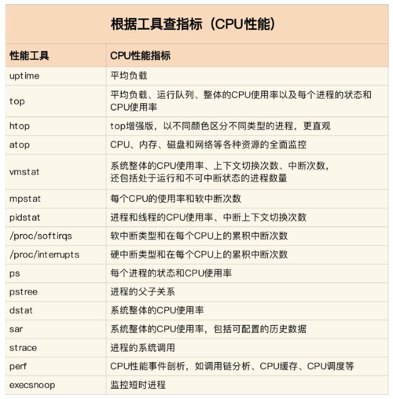

# CPU性能篇

## CPU性能问题定位

cpu作为程序执行的主体，通常是系统的瓶颈。在遇到CPU性能问题的时候，我们应该如何定位问题？在专栏中给出了答案：

首先，找出系统的瓶颈点，通常可以使用top工具发现问题的方向；

然后，使用特定的工具跟进问题，定位问题的根因。

在专栏中给出了一个大体的示例，如下所示：

当然也可以根据具体的指标然后使用对应的工具跟进：

由于机器上安装的工具可能不全，并且没有root权限，所以有时需要使用已经安装的工具查看对应的指标：

## 性能优化思路

通过工具可以定位到具体的性能问题，但是是否进行优化，还需要核对如下问题：

1. 既然要做性能优化,那要怎么判断它是不是有效呢?特別是优化后,到底能提升多少性自能呢?
2. 性能问题通常不是独立的,如果有多个性问题同时发生,你应该先优化哪一个呢?
3. 提升性能的方法并不是唯一的,当有多种方法可以选择时,你会选用哪一种呢?是不是总选那个最大程度提升性能的方法就行了呢?

我的总结是要全局的看优化方式，不能只看一点，避免`我觉得`的优化，需要用更多的数据说话，因此专栏中也提出要通过多个维度比较优化前和优化后的效果。

同时在实际优化中也需要考虑优化成本和收益是否满足实际状况。

通常，在从程序的不同层面可以有不同的方法：

* 应用层面：编译器优化、算法优化、异步处理、多线程代替多进程和缓存优化；
* 系统层面：CPU绑定、CPU独占、优先级调整、为进程设置资源限制、NAMU优化和中断负载平衡。

