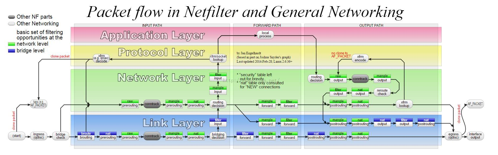

# 网络性能篇

## 代替ping的网络测试

### hping3发送SYN包

```
# -c表示发送3次请求,-S表示设置 TCP SYN，-p表示端口号为80
# hping3 -c 3 -S -p 80 baidu.com
```

### traceroute代替

```
# tcp表示使用TCP协议,-p表示端口号,-n表示不对结果中的IP地址执行反向域名解析
# traceroute --tcp -p 80 -n baidu.com
traceroute to baidu.com (39.156.69.79), 30 hops max, 60 byte packets
 1  10.0.2.2  2.304 ms  2.218 ms  2.231 ms
 2  39.156.69.79  10.617 ms  12.382 ms  7.135 ms
```

traceroute会在路由的每一跳发送三个包,并在收到响应后,输出往返延时。如果无响应或者响应超时(默认5s),就会输出一个星号。

## 网络包的处理流程



在这张图中,绿色背景的方框,表示表( table),用来管理链。 Linux支持4种表,包括filter(用于过滤)、nat(用于NAT)、 mangle(用于修改分组数据)和raw(用于原始数据包)等。

跟 table一起的白色背景方框,则表示链( chain),用来管理具体的 iptables规则。每个表中可以包含多条链,比如filter表中,内置 INPUT、 OUTPUT和 FORWARD链; nat表中,内置 PREROUTING、 POSTROUTING、 OUTPUT等。

当然,你也可以根据需要,创建你自己的链。

灰色的 conntrack,表示连接跟踪模块。它通过内核中的连接跟踪表(也就是哈希表), 记录网络连接的状态,是 iptables状态过滤(- m state)和NAT的实现基础。
iptables的所有规则,就会放到这些表和链中,并按照图中顺序和规则的优先级顺序来执


----
